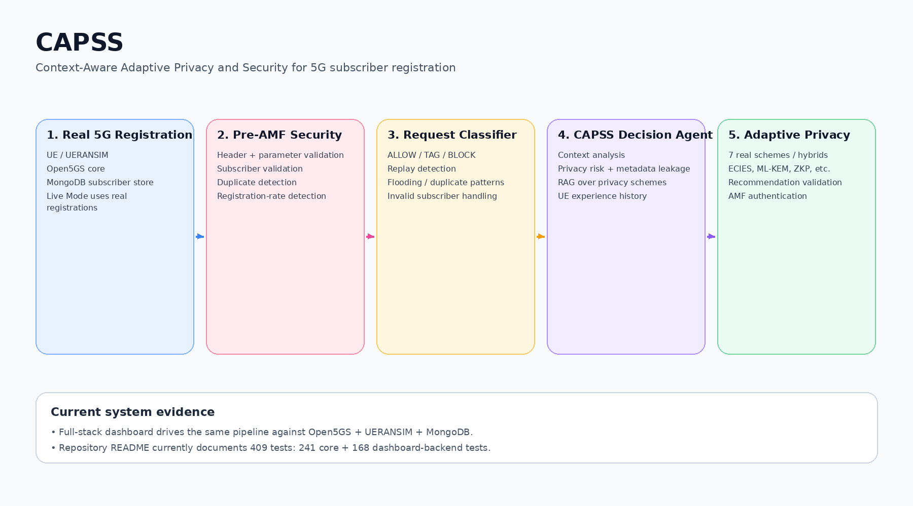

# 🛡️ CAPSS — Context-Aware Adaptive Privacy & Security System

> **Adaptive privacy intelligence for real 5G subscriber registration.**

[](https://www.python.org/)
[](https://fastapi.tiangolo.com/)
[](https://react.dev/)
[](https://www.typescriptlang.org/)
[](#architecture)
[](#testing)

CAPSS is an autonomous privacy/security decision system that recommends and adapts a cryptographic privacy scheme for each 5G UE registration.

The current implementation combines:

**Systems → Privacy Analysis → CAPSS Agent → Privacy Recommendation**

and exposes the same pipeline through a full-stack Live Mode dashboard connected to **Open5GS + UERANSIM + MongoDB**.

## ✨ Core capabilities

- 🔐 Pre-AMF registration validation and suspicious-behaviour detection
- 🧩 Request classification: **ALLOW / TAG / BLOCK**
- 📊 Privacy-risk analysis covering metadata leakage and correlation/linkability
- 🧠 Context-aware decision agent using registration history and RAG
- 🔑 Knowledge base containing **7 privacy schemes / hybrid options**
- 📡 Real Open5GS + UERANSIM registration flow
- 🖥️ React + TypeScript dashboard backed by FastAPI
- 🧪 Automated core and dashboard-backend testing
- 📈 Ablation-study and real-hardware stress-test scripts

## 🏗️ Architecture



> Mermaid source: [`architecture.mmd`](architecture.mmd)

### Decision context

The agent can reason over:

- registration history
- registration frequency
- duplicate behaviour
- subscriber context
- privacy score
- previous privacy policy
- retrieved privacy-scheme knowledge

## 🔑 Privacy schemes

The current knowledge base covers seven scheme families / options including:

- ECIES
- ML-KEM
- Group Signatures
- Differential Privacy
- Zero-Knowledge Proofs
- SUPI Rearrangement
- hybrid combinations

## 🧰 Tech stack

| Layer | Technologies |
|---|---|
| 5G core | Open5GS |
| UE / gNB simulation | UERANSIM |
| Subscriber store | MongoDB |
| Backend | Python, FastAPI, Uvicorn |
| Frontend | React, TypeScript, Vite |
| Privacy / crypto | `cryptography`, `liboqs-python` |
| Data / analysis | Pandas, NumPy, Matplotlib |
| AI explanation | Gemini API (optional dashboard explanation text) |
| Environment | WSL2 Ubuntu 22.04 |

## 🧪 Testing

The current repository documents:

```text
409 total tests
├── 241 core CAPSS / systems / privacy tests
└── 168 dashboard-backend tests
```

Run:

```bash
cd ~/5g-project/agent
python3 -m pytest -q
```

A mentor/demo flow is also available without Open5GS/UERANSIM:

```bash
python3 demo_for_mentor.py
```

## 📡 Live Mode

The dashboard's Live Mode drives the real Open5GS + UERANSIM pipeline.

High-level startup:

```bash
# Start gNB
sudo ~/5g-project/agent/systems/scripts/start_gnb.sh

# Check Open5GS core
~/5g-project/agent/systems/scripts/check_core.sh

# Backend
cd ~/5g-project/agent
./run_dashboard_backend.sh

# Frontend
cd ~/5g-project/dashboard_frontend
npm run dev
```

**Important:** run backend/hardware commands inside WSL using a WSL-native Node installation.

## 📊 Experimentation

The repository includes:

- ablation study scripts
- real-hardware scaling stress tests
- per-scenario pipeline evaluation
- dashboard-backend tests

Example:

```bash
cd ~/5g-project/agent
python3 -m dashboard_backend.scripts.ablation_study --num-scenarios 20 --seed 42
```

## 📁 Repository structure

```text
CAPSS/
├── agent/
│   ├── capss/                 # reasoning, context, RAG, policy generation
│   ├── systems/               # Pre-AMF threat classification + orchestration
│   ├── privacy/               # privacy / metadata / correlation analysis
│   ├── data/                  # privacy-scheme knowledge base
│   ├── tests/                 # core tests
│   ├── dashboard_backend/     # FastAPI + Live Mode
│   └── logging/               # AMF log parsing
├── dashboard_frontend/        # React + TypeScript + Vite
└── README.md
```

## 🎯 Research direction

CAPSS explores how privacy protection can become **context-aware rather than static**, while keeping the decision process connected to real 5G registration behaviour.

---

**Repository:** https://github.com/BanuVarsha10/CAPSS
